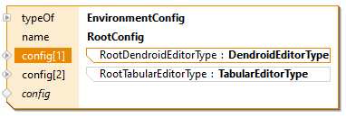
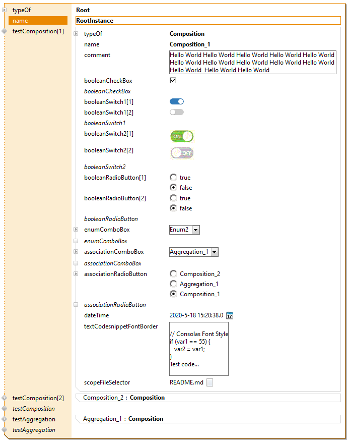
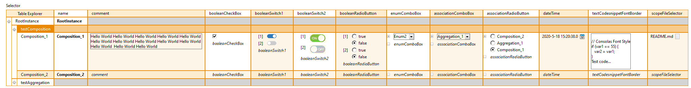

# Dendroid/Tabular Editor Type
In this project we will show how to style the actifsource editor.

### Dendroid Editor

### Tabular Editor

## Requirements
Actifsource  Workbench Community Edition

## License
[http://www.actifsource.com/company/license](http://www.actifsource.com/company/license)
Test2